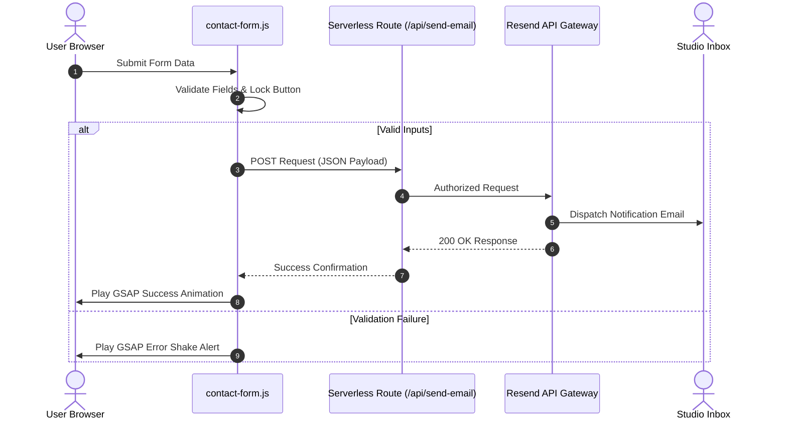

```
  ____                  ____                     
 |  _ \ __ _ _ __ ___  |  _ \  _____   _____ ___ 
 | |_) / _` | '__/ _ \ | | | |/ _ \ \ / / __/ __|
 |  _ < (_| | | |  __/ | |_| |  __/\ V /\__ \__ \
 |_| \_\__,_|_|  \___| |____/ \___| \_/ |___/___/
                                                 
       - P R O D U C T - D R I V E N  S T U D I O -
```

# RARE DEVS // CREATIVE TECHNOLOGY STUDIO

> Every product has a story. We help build it.
> We are a product-driven creative technology studio focusing on designing and developing seamless digital experiences. We believe technology should feel natural, seamless, and intuitive, guiding users effortlessly through every interaction.

[raredevs.tech](https://raredevs.tech) • [LinkedIn](https://www.linkedin.com/company/rare-devs/) • [Instagram](https://www.instagram.com/rare_devs) • [X (Twitter)](https://x.com/rare_devs)

---

## 🔮 The Studio Manifesto

At **Rare Devs**, we build digital systems that balance complex, high-performance logic with fluid, immersive visual design. We operate at the intersection of aesthetic grid structures and bulletproof serverless engineering. Every line of code and every interaction is placed **nicely and intentionally**.

---

## 🔬 Our Engineering & Design Pillars

### 1. High-Fidelity Development
Crafting highly scalable web applications, real-time microservices, and mobile applications. We use type-safe architectures, modern backend runtimes, and fast compiler toolchains.

### 2. Immersive Brand & UI/UX
Creating sleek, high-end interfaces that command attention. Utilizes advanced CSS layouts, responsive design tokens, and smooth scroll animations (GSAP & Lenis) to elevate user experience.

### 3. Serverless & Cloud Infrastructure
Building server-independent pipelines. All contact mechanisms, notifications, and delivery functions run on containerized microservices and serverless gateways for rapid scaling and low latency.

---

## 🛠️ Capability Matrix (30 Core Technologies)

Our developers and designers deploy a robust set of tools to bring products to life:

| Languages | Frontend & Libraries | Backend & Runtimes | Cloud & DevOps |
| --- | --- | --- | --- |
| 🌐 HTML5 / CSS3 | ⚛️ React.js | 🟢 Node.js | 🐳 Docker |
| 🟨 JavaScript | 🏎️ Next.js | 🐍 Django | ☁️ AWS |
| 🟦 TypeScript | 🟩 Vue.js | 🔵 Go (Golang) | 🔸 Google Cloud |
| ☕ Java | 🟧 Svelte | 🦁 NestJS | 🔄 CI/CD Pipelines |
| 🐍 Python | 🎨 Tailwind CSS | 🌶️ Flask API | 🛡️ Vercel Routing |
| 🦀 Rust | 📲 Mobile Dev | 🍃 MongoDB | 🗄️ PostgreSQL |
| ➕ C++ / C# | 🎨 UI/UX Design | 💾 Redis | 🐬 MySQL |
| 🐘 PHP | ⚡ GSAP Motion | ☕ Java VM | 🔑 Resend Gateway |

---

## 🚀 Repository & GridFolio Architecture

This repository holds the codebase for **GridFolio**, our flagship cyberpunk-themed agency showcase.

### 📡 Serverless Mail Pipeline
We replaced static layout forms with an active serverless messaging pipeline:
* **Controller:** [`js/contact-form.js`](file:///c:/Users/user/Desktop/GridFolio/js/contact-form.js) intercepts submissions, validates input vectors, and handles submit state locks.
* **Serverless Route:** [`api/send-email.js`](file:///c:/Users/user/Desktop/GridFolio/api/send-email.js) handles authorization and forwards messages to the studio inbox via the **Resend API**.
* **Visual Validation:** Uses GSAP spring-shake physics to display alerts for invalid inputs and slides open dynamic feedback alerts on successful delivery.



### 🎠 Infinite Scroll Tech Carousel
On the About page, we designed a dynamic scroll-linked slider showcasing our 30-item capability matrix:
* **Fluid Layout:** Uses dynamic flex-basis sizing (`380px` on desktop, `80vw` on mobile) inside a `width: max-content` wrapper.
* **Scroll-Bound Translation:** GSAP ScrollTrigger automatically calculates bounds (`-(wrapperWidth - containerWidth)`) to execute smooth horizontal translations as the user scrolls vertically.

### 📈 100% SEO Crawler Matrix
* **Meta Structuring:** Structured headers containing unique meta descriptions, Canonical URLs, and Open Graph cards across all static pages.
* **JSON-LD Schema:** Embedded Rich-Schema data detailing Rare Devs' organization contacts, location vectors, service offerings, and social networks for maximum search index authority.
* **Index maps:** Automatically generated sitemap maps ([`public/sitemap.xml`](file:///c:/Users/user/Desktop/GridFolio/public/sitemap.xml)) and search permission lists ([`public/robots.txt`](file:///c:/Users/user/Desktop/GridFolio/public/robots.txt)).

---

## 💻 Local Setup & Development

### 1. Clone & Install Dependencies
Ensure you have [Node.js](https://nodejs.org/) and [pnpm](https://pnpm.io/) installed:
```bash
pnpm install
```

### 2. Boot Local Environment
Starts the Vite dev server with fast hot-reload:
```bash
pnpm dev
```

### 3. Build & Minify for Production
Compiles and bundles index scripts, assets, and styling sheets:
```bash
pnpm build
```

---

<div align="center">
  <sub>© 2026 Rare Devs. Built for high performance and visual excellence.</sub>
</div>
