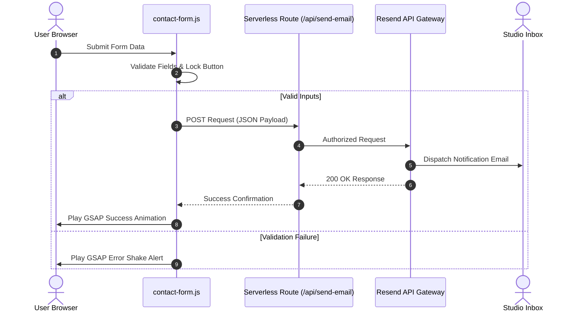

```
  ____                  ____                     
 |  _ \ __ _ _ __ ___  |  _ \  _____   _____ ___ 
 | |_) / _` | '__/ _ \ | | | |/ _ \ \ / / __/ __|
 |  _ < (_| | | |  __/ | |_| |  __/\ V /\__ \__ \
 |_| \_\__,_|_|  \___| |____/ \___| \_/ |___/___/
                                                 
       - P R O D U C T - D R I V E N  S T U D I O -
```

# RARE DEVS // CREATIVE TECHNOLOGY STUDIO

> Every product has a story. We help build it.
> We are a product-driven creative technology studio focusing on designing and developing seamless digital experiences. We believe technology should feel natural, seamless, and intuitive, guiding users effortlessly through every interaction.

[raredevs.tech](https://raredevs.tech) • [LinkedIn](https://www.linkedin.com/company/rare-devs/) • [Instagram](https://www.instagram.com/rare_devs) • [X (Twitter)](https://x.com/rare_devs)

---

## 🔮 The Studio Manifesto

At **Rare Devs**, we build digital systems that balance complex, high-performance logic with fluid, immersive visual design. We operate at the intersection of aesthetic grid structures and bulletproof serverless engineering. Every line of code and every interaction is placed **nicely and intentionally**.

---

## 🔬 Our Engineering & Design Pillars

### 1. High-Fidelity Development
Crafting highly scalable web applications, real-time microservices, and mobile applications. We use type-safe architectures, modern backend runtimes, and fast compiler toolchains.

### 2. Immersive Brand & UI/UX
Creating sleek, high-end interfaces that command attention. Utilizes advanced CSS layouts, responsive design tokens, and smooth scroll animations (GSAP & Lenis) to elevate user experience.

### 3. Serverless & Cloud Infrastructure
Building server-independent pipelines. All contact mechanisms, notifications, and delivery functions run on containerized microservices and serverless gateways for rapid scaling and low latency.

---

## 🛠️ Capability Matrix (30 Core Technologies)

Our developers and designers deploy a robust set of tools to bring products to life:

| Languages | Frontend & Libraries | Backend & Runtimes | Cloud & DevOps |
| --- | --- | --- | --- |
| 🌐 HTML5 / CSS3 | ⚛️ React.js | 🟢 Node.js | 🐳 Docker |
| 🟨 JavaScript | 🏎️ Next.js | 🐍 Django | ☁️ AWS |
| 🟦 TypeScript | 🟩 Vue.js | 🔵 Go (Golang) | 🔸 Google Cloud |
| ☕ Java | 🟧 Svelte | 🦁 NestJS | 🔄 CI/CD Pipelines |
| 🐍 Python | 🎨 Tailwind CSS | 🌶️ Flask API | 🛡️ Vercel Routing |
| 🦀 Rust | 📲 Mobile Dev | 🍃 MongoDB | 🗄️ PostgreSQL |
| ➕ C++ / C# | 🎨 UI/UX Design | 💾 Redis | 🐬 MySQL |
| 🐘 PHP | ⚡ GSAP Motion | ☕ Java VM | 🔑 Resend Gateway |

---

## 🚀 Architecture & Development Matrix

This repository houses **GridFolio**, the digital showcase of Rare Devs. It is organized for fast static loading and clean serverless routing:

### 📁 Directory Anatomy
```text
GridFolio/
├── 📂 api/                   # Serverless execution layer
│   └── 📄 send-email.js      # Resend API mail routing gateway
├── 📂 js/                    # Client interface dynamics
│   ├── 📄 contact-form.js    # Contact validation & GSAP animations
│   └── 📄 observatory.js     # Tech carousel scroll animation
├── 📂 css/                   # Responsive typography & layouts
│   └── 📄 observatory.css    # Dynamic carousel style sheets
├── 📂 public/                # Static public assets
│   ├── 📄 sitemap.xml        # SEO crawler mapping
│   └── 📄 robots.txt         # Search crawler policies
└── 📄 vite.config.js         # Multi-page Vite compilation config
```

### 📡 Pipeline Matrix

#### 1. Serverless Mail Gateway
We replaced static form layouts with a secure serverless mailing channel:
* **The Logic (`js/contact-form.js`)**: Validates DOM elements, blocks duplicate clicks, and manages form submission locks.
* **The Bridge (`api/send-email.js`)**: Processes authorization tokens and securely fires payload envelopes to the **Resend API**.
* **Visual States**: Built with GSAP spring engines. Failure events trigger a horizontal input shake and a warning orange glow; success events slide open a confirmation modal.



#### 2. Scroll-Linked Tech Slider
A fluid, touch-friendly horizontal track on the About page displaying 30 technology stacks:
* **Structural CSS**: Sets container `width: max-content` with cards fixed to a baseline flex-width (`380px` on desktop / `80vw` on mobile).
* **Tween Calculations**: GSAP computes bounds on runtime (`-(wrapperWidth - containerWidth)`) to execute smooth translation matrices during vertical scrolling.

#### 3. SEO Integrity Layer
* **Unique Metadata**: Page-specific titles, meta descriptions, and canonical headers targeting `raredevs.tech`.
* **Social Previews**: Open Graph and Twitter Card tags deployed for links.
* **JSON-LD Schema**: Schema structures detailing company contacts, service portfolios, and verified social handles.

---

## 💻 Terminal Commands

### 📦 Setup & Installation
Install the project dependencies locally using `pnpm`:
```bash
pnpm install
```

### ⚡ Development Environment
Boot the Vite server with live hot-reloading:
```bash
pnpm dev
```

### 🚀 Production Compilation
Compile and optimize index files, static assets, and stylesheets for deployment:
```bash
pnpm build
```

---

<div align="center">
  <sub>© 2026 Rare Devs. Built for high performance and visual excellence.</sub>
</div>
